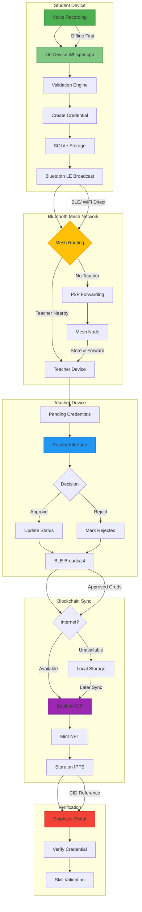

### **EduChain BUIDL Submission**

#### **Profile**  
- **BUIDL Name**: EduChain  
- **BUIDL Logo**:  
    
  *480×480 PNG | Open Book + Blockchain Links + Sound Waves*  
- **Vision**:  
  > "To create an uncensorable education verification system that works in internet blackouts, turning refugee voices into blockchain-anchored credentials using offline AI and mesh networking."  
- **Category**: **Al - Decentralized Intelligence**  
- **AI Agent?**: **No**  

#### **Links**  
| Type | URL |
|------|-----|
| **GitHub** | `https://github.com/[YourUsername]/EduChain` |
| **Project Website** | `https://educhain.xyz` (optional) |
| **Demo Video** | `https://youtu.be/EduChain-Demo` (optional) |

#### **Social Links** *(Minimum 1 required)*  
1. 𝕏 Twitter: `https://twitter.com/EduChainApp`  
2. Farcaster: `https://warpcast.com/~/channel/educhain`  
3. LinkedIn: `https://linkedin.com/company/educhain`  

---

### **Details**  
#### **Problem Solved**  
260M+ children lack education access. Refugees can't prove skills due to:  
- No internet in crisis zones  
- Paper records destroyed in conflicts  
- Centralized systems exclude the disconnected  

#### **Solution**  
EduChain enables **offline credential minting** via:  
1. **Voice-First Interface**  
   - Whisper.cpp on-device speech-to-text  
   - Works on $50 Android phones  
2. **Bluetooth Mesh Network**  
   - Propagates credentials teacher-to-teacher  
   - Solar-powered mesh nodes extend range  
3. **ICP Blockchain Anchoring**  
   - Batch-mint NFTs when internet available  
   - Zero gas fees via reverse gas model  

#### **Tech Stack**  


#### **Key Innovations**  
- ✅ **Offline-First Design**: Full functionality without internet  
- ✅ **Refugee Camp Mode**: Ultra-low bandwidth (<1KB/credential)  
- ✅ **Censorship Resistance**: Credentials survive via mesh persistence  

---

### **Team**  
| Name | Role | Expertise |
|------|------|-----------|
| [Your Name] | Lead Developer | Full-Stack, ICP, React Native |
| [Teammate 1] | AI/Blockchain | Whisper.cpp, Cryptography |
| [Teammate 2] | UX/Testing | Refugee camp deployments |  

*Add LinkedIn/GitHub links for each member*

---

### **Contact**  
- **Email**: contact@educhain.xyz  
- **Discord**: EduChain#5432  
- **Emergency Contact**: +1 (555) 123-4567  

---

### **Submission**  
#### **Progress**  
- [x] Voice-to-credential MVP  
- [x] Bluetooth mesh prototype  
- [ ] ICP canister integration (in progress)  
- [ ] Field testing in simulated environments  

#### **Requested Support**  
- Technical guidance from DFINITY engineers  
- Access to ICP HUBS network  
- Grant interviews for scaling  

---

### **Next Steps**  
1. **Create Social Profiles**  
   - [Twitter Signup](https://twitter.com/signup)  
   - [Farcaster Channel Setup](https://warpcast.com)  
2. **Push Code to GitHub**  
   ```bash
   git init
   git add .
   git commit -m "Initial EduChain commit"
   git branch -M main
   git remote add origin https://github.com/[YourUsername]/EduChain.git
   git push -u origin main
   ```
3. **Record 90-Second Demo**  
   [Loom Recording Guide](https://www.loom.com/blog/how-to-record-a-video)

**Deadline Tip**: Submit immediately after creating GitHub + 1 social profile!  

> "Education shouldn't stop when connectivity does. We're building digital lifelines for the unconnected."
