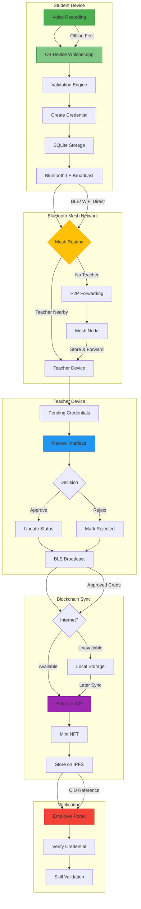

### **EduChain BUIDL Submission**

#### **Profile**  
- **BUIDL Name**: EduChain  
- **Vision**:  
  > "To create an uncensorable education verification system that works in internet blackouts, turning refugee voices into blockchain-anchored credentials using offline AI and mesh networking."  
- **Category**: **Al - Decentralized Intelligence**  

#### **Links**  
| Type | URL |
|------|-----|
| **GitHub** | `(https://github.com/Shivavigneshkannan-k/EDUCHAIN)` |

### **Details**  
#### **Problem Solved**  
260M+ children lack education access. Refugees can't prove skills due to:  
- No internet in crisis zones  
- Paper records destroyed in conflicts  
- Centralized systems exclude the disconnected  

#### **Solution**  
EduChain enables **offline credential minting** via:  
1. **Voice-First Interface**  
   - Whisper.cpp on-device speech-to-text  
   - Works on $50 Android phones  
2. **Bluetooth Mesh Network**  
   - Propagates credentials teacher-to-teacher  
   - Solar-powered mesh nodes extend range  
3. **ICP Blockchain Anchoring**  
   - Batch-mint NFTs when internet available  
   - Zero gas fees via reverse gas model  

#### **Tech Stack**  

#### **Key Innovations**  
- ✅ **Offline-First Design**: Full functionality without internet  
- ✅ **Refugee Camp Mode**: Ultra-low bandwidth (<1KB/credential)  
- ✅ **Censorship Resistance**: Credentials survive via mesh persistence  

---

### **Team**  
| Name | Role | Expertise |
|------|------|-----------|
| Jasom santo leon J | BE CSE student | Full-Stack, ICP, React Native |
| Shiva vignesh kannan | AI/Blockchain | Whisper.cpp, Cryptography |
| kavi | UX/Testing | Refugee camp deployments |  
| gayathri | Full-Stack, ICP, React Native |
| gayathri | Full-Stack, ICP, React Native |

*Add LinkedIn/GitHub links for each member*

---

### **Contact**  
- **Email**: jasonsantoleonj.cse2023@citchennai.net  

### **Submission**  
#### **Progress**  
- [x] Voice-to-credential MVP  
- [ ] Bluetooth mesh prototype  
- [ ] ICP canister integration (in progress)  
- [ ] Field testing in simulated environments  

#### **Requested Support**  
- Technical guidance from DFINITY engineers  
- Access to ICP HUBS network  
- Grant interviews for scaling  
